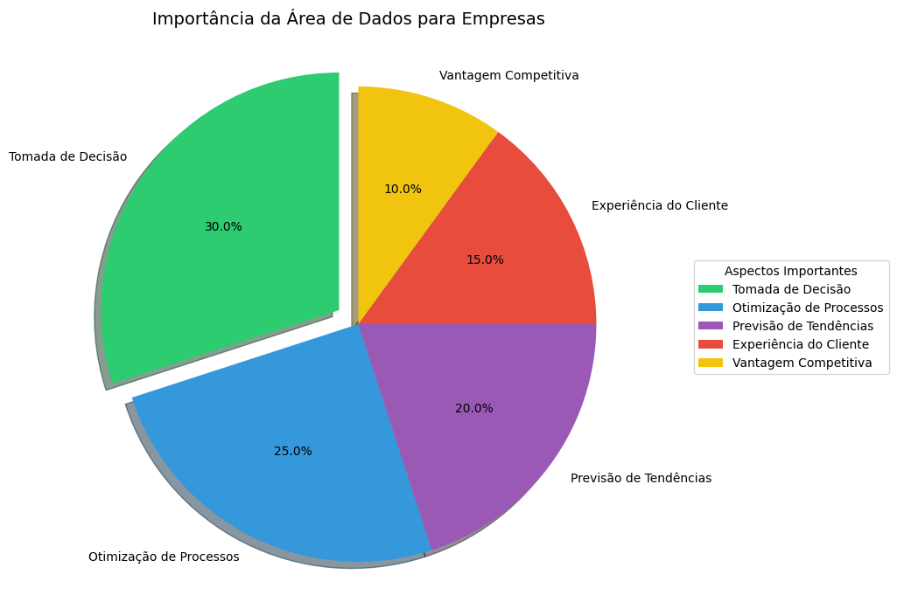
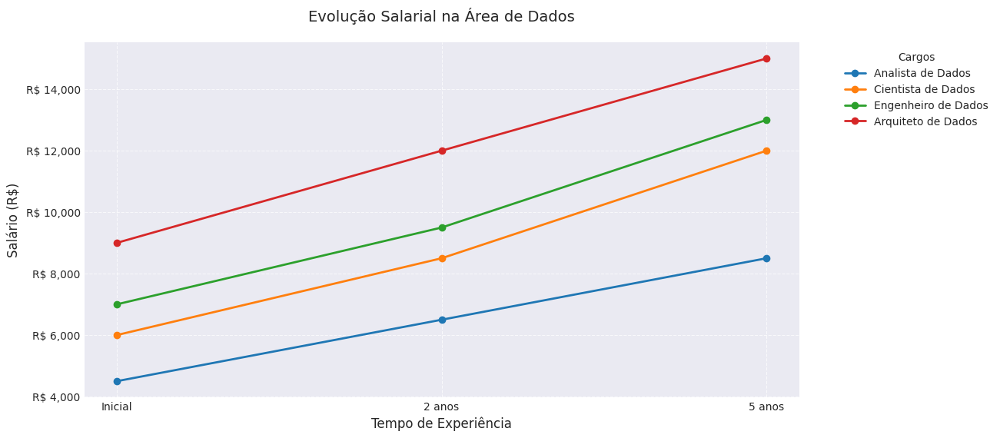

# Visualização de Dados do Projeto

Este repositório contém gráficos gerados a partir de notebooks de análise de dados.

## Gráfico 1: Importância da Área de Dados para Empresas

Este gráfico de pizza ilustra a importância percebida de diferentes aspectos da ciência de dados para o sucesso empresarial.

## Gráfico 2: Evolução Salarial na Área de Dados

Este gráfico de linhas mostra a progressão salarial esperada para diferentes cargos na área de dados ao longo do tempo.

